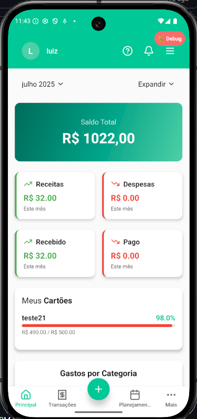
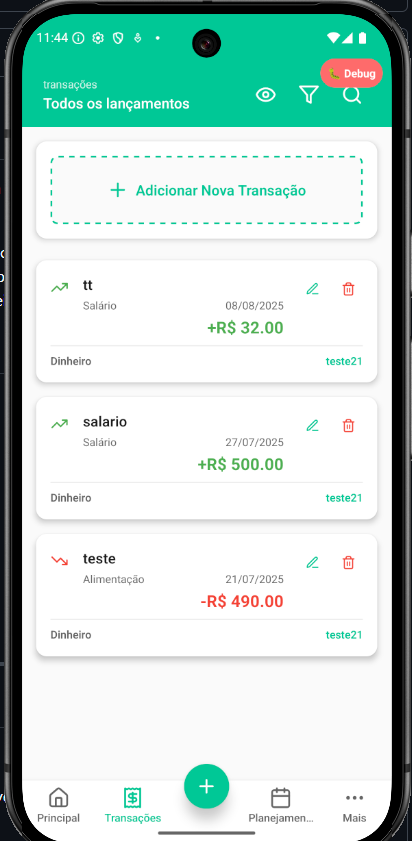

# FinanceApp

> ⚠️ **ATENÇÃO:** Este projeto está em desenvolvimento e ainda não está finalizado. Algumas funcionalidades podem estar incompletas ou sujeitas a alterações.

FinanceApp é uma solução completa para gestão financeira pessoal, composta por um aplicativo mobile (frontend) e uma API robusta (backend). O projeto foi desenvolvido para proporcionar controle, praticidade e segurança na administração de contas, cartões, categorias e transações financeiras.

## Sumário
- [Visão Geral](#visão-geral)
- [Funcionalidades](#funcionalidades)
- [Arquitetura](#arquitetura)
- [Tecnologias Utilizadas](#tecnologias-utilizadas)
- [Instalação](#instalação)
- [Como Executar](#como-executar)
- [Testes](#testes)
- [Contribuição](#contribuição)
- [Licença](#licença)

---

## Visão Geral

### Telas do App

<p align="center">
    
    
    
    
</p>
O FinanceApp é dividido em dois principais módulos:
- **Frontend (Mobile):** Aplicativo desenvolvido com React Native e Expo, focado em experiência do usuário, responsividade e integração com recursos nativos.
- **Backend (API):** API Node.js com Express, utilizando Prisma ORM para persistência de dados em banco relacional, autenticação JWT, e integração com serviços externos.

## Funcionalidades
### App Mobile
- Cadastro e login de usuários
- Visualização e gerenciamento de contas bancárias e cartões
- Registro e categorização de transações
- Relatórios e gráficos financeiros
- Sincronização offline/online
- Interface intuitiva e responsiva

### Backend
- Autenticação e autorização JWT
- CRUD completo para contas, cartões, categorias e transações
- Gerenciamento de usuários premium
- Integração com bancos e provedores externos
- API RESTful documentada
- Testes automatizados com Jest

## Arquitetura
```
financeapp/
├── backend/        # API Node.js
│   ├── src/
│   ├── prisma/
│   ├── __tests__/
│   └── ...
└── financeapp/     # App Mobile React Native
    ├── app/
    ├── components/
    ├── context/
    ├── hooks/
    ├── screens/
    ├── services/
    └── ...
```

## Tecnologias Utilizadas
- **Frontend:** React Native, Expo, TypeScript, Styled Components
- **Backend:** Node.js, Express, Prisma ORM, PostgreSQL, JWT, Jest
- **DevOps:** Docker, EAS, GitHub Actions

## Instalação
### Pré-requisitos
- Node.js >= 18
- Expo CLI
- Docker (opcional para banco de dados)
- PostgreSQL

### Backend
```bash
cd backend
npm install
npx prisma migrate dev
npm run dev
```

### Mobile
```bash
cd financeapp
npm install
npx expo start
```

## Como Executar
- Inicie o backend: `npm run dev` na pasta `backend`
- Inicie o app mobile: `npx expo start` na pasta `financeapp`
- Configure variáveis de ambiente conforme exemplos em `.env.example`

## Testes
- Backend: `npm test` (Jest)
- Mobile: `npm test` (Jest)

## Contribuição
1. Fork este repositório
2. Crie uma branch: `git checkout -b minha-feature`
3. Commit suas alterações: `git commit -m 'Minha feature'`
4. Push para o branch: `git push origin minha-feature`
5. Abra um Pull Request

## Licença
Este projeto está sob a licença MIT.

---

> Para dúvidas, sugestões ou problemas, abra uma issue ou entre em contato com os mantenedores.
